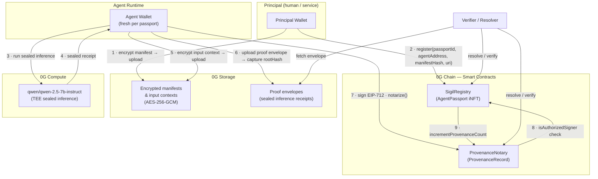

# Sigil Protocol

**Identity and provenance infrastructure for autonomous AI agents, built on 0G.**

Sigil links two on-chain primitives permanently:

- **AgentPassport** — an ERC-7857-compatible iNFT that gives any AI agent a portable, verifiable identity anchored to a human or service principal.
- **ProvenanceRecord** — an on-chain notarization for any consequential AI-generated artifact, binding the output to the model, the input context, and the signing agent.

The full accountability chain is a chain of on-chain view calls:

```
artifact → recordId → agent wallet → passportId → principal
```

Anyone can resolve this chain. No trust in the platform required.

---

## The Problem

AI agents are proliferating but lack the basic identity and accountability infrastructure that every other consequential actor in finance, law, and software already has:

- A consumer cannot verify which agent produced an output or which human authorized it.
- An operator cannot prove that a signed decision came from the expected autonomous runtime.
- Reputation is locked inside platforms — it cannot travel with the agent across deployments.
- AI-generated artifacts have no durable provenance — they can be silently altered, misattributed, or denied.

Sigil addresses this by making agent identity portable and artifact provenance on-chain and cryptographically bound.

---

## Architecture



---

## Dual Wallet Model

Sigil separates control from execution:

| Wallet | Role | Signs what |
|---|---|---|
| **Principal** | Owns the passport iNFT, holds funds, sets permissions | `register()` once; manifest decrypt |
| **Agent** | Fresh keypair per passport, autonomous signer | Every `notarize()` call |

The principal authorizes the agent once at registration. After that, the agent signs notarizations autonomously — no per-action principal interaction. On-chain, `ProvenanceNotary.notarize()` calls `SigilRegistry.isAuthorizedSigner(passportId, msg.sender)` to enforce this. The principal can rotate or revoke the agent at any time.

This is why a resolver can simultaneously prove:
- which autonomous signer produced an artifact, and
- which human or service principal originally authorized that signer.

---

## How It's Made

**0G Chain** hosts two Solidity contracts deployed on 0G Galileo (chain ID 16602):

- `SigilRegistry` — ERC-7857-compatible iNFT registry. Soulbound (transfers revert). Manages dual-wallet signer authorization, keeper relay set, reputation scoring, and provenance count. Includes `appendFingerprint` and `appendAttestation` for keeper relay use.
- `ProvenanceNotary` — EIP-712 notarization records with per-signer nonce replay protection and on-chain reverse lookup from output hash → record.

**0G Storage** is used for all off-chain payloads:
- Permission manifests: encrypted with AES-256-GCM, key derived via HKDF from a principal signature — plaintext never leaves the principal's machine.
- Input contexts: same encryption scheme, keyed to the agent.
- Proof envelopes: sealed inference receipts from 0G Compute, stored as JSON. Their `keccak256` hash is the `modelFingerprintHash` anchored on-chain.

**0G Compute** powers all sealed inference. Every chat agent response runs through `qwen/qwen-2.5-7b-instruct` via `@0glabs/0g-serving-broker`, which produces a TEE-verified receipt binding model + input → output. This receipt is hashed on-chain before the output is shown to the user.

**TypeScript SDK** (`sdk/`, package `sigil-protocol`) wraps all three 0G primitives. It handles:
- Registration: keypair generation, manifest encryption, 0G Storage upload, on-chain `register()`.
- Notarization: input context encryption, sealed receipt upload, EIP-712 signing, on-chain `notarize()`.
- Resolution: on-chain reads plus 0G Storage fetch for proof envelopes and manifest decryption.

**Demo agents and REPL** (`demo/`) show the SDK in four different usage shapes:
- `RiskScorerAgent` — fetches real DeFi protocol data from DefiLlama, runs sealed inference for a risk score, notarizes the result.
- `AuditAgent` — runs smart contract security audit via sealed inference, notarizes findings.
- `PromptAgent` / chat REPL — generic sealed inference agent; every reply notarized on-chain live in the terminal.
- `NotarizeOnlyAdapter` — for agents already running their own LLM (OpenAI, Anthropic, etc.); notarizes external outputs without requiring 0G Compute.

**Next.js resolver UI** (`demo/ui/`) reads live from the 0G chain. Resolves passportId, recordId, agent address, or output hash. Renders the full accountability chain, decrypts permission manifests in-browser for the matching principal wallet.

The notable hackathon shortcut: the auto-attest sidecar (`sdk/src/passport/AutoAttest.ts`) simulates keeper-driven attestations so reputation counters move in real time during demos, while the core notarization path is fully real and on-chain.

---

## Live Deployment

| | |
|---|---|
| Network | 0G Galileo Testnet |
| Chain ID | `16602` |
| RPC | `https://evmrpc-testnet.0g.ai` |
| Explorer | `https://chainscan-galileo.0g.ai` |
| Faucet | `https://faucet.0g.ai` |

| Contract | Address |
|---|---|
| `SigilRegistry` | [`0x2C0457F82B57148e8363b4589bb3294b23AE7625`](https://chainscan-galileo.0g.ai/address/0x2C0457F82B57148e8363b4589bb3294b23AE7625) |
| `ProvenanceNotary` | [`0xA1103E6490ab174036392EbF5c798C9DaBAb24EE`](https://chainscan-galileo.0g.ai/address/0xA1103E6490ab174036392EbF5c798C9DaBAb24EE) |

Live on-chain records:

| | |
|---|---|
| PromptAgent passportId | `0x87c4d2f5fdb754702532cdfb55c279e83fbd343fa2f42618d836e485c419a36d` |
| RiskScorerAgent passportId | `0x4a2c793f17dd95824d638d9ecb4c7625d2b31164d45eacaa42a128ea714d83ca` |
| AuditAgent passportId | `0xb2a7894be763a5286aa1dc58e161818dcdfb149937217d31cc6a81f601917ec0` |
| Recent notarizeTx | [`0xadf14d01fd433fb4bcf567a16f5d4b5b2ffd33071116a742bbaf6de8351b2738`](https://chainscan-galileo.0g.ai/tx/0xadf14d01fd433fb4bcf567a16f5d4b5b2ffd33071116a742bbaf6de8351b2738) |

---

## Repo Layout

```
sigil-protocol/
├── contracts/          Solidity contracts + Hardhat tests (48/48 passing)
│   ├── SigilRegistry.sol
│   ├── ProvenanceNotary.sol
│   ├── SigilRegistry.flat.sol    flattened for explorer verification
│   └── ProvenanceNotary.flat.sol flattened for explorer verification
├── sdk/                TypeScript SDK (sigil-protocol)
│   └── src/
│       ├── passport/   AgentPassport + AutoAttestSidecar
│       ├── provenance/ ProvenanceNotaryClient
│       ├── adapters/   ZeroGStorageAdapter, ZeroGComputeAdapter, KeeperHubAdapter
│       └── utils/      crypto, logger, errors, withRetry
├── demo/
│   ├── agents/         RiskScorerAgent, AuditAgent, ChatAgent, NotarizeOnly
│   ├── scripts/        CLI runners + chat REPL + top-up-agent
│   ├── scenarios/      scenario1 (identity), scenario2 (provenance), scenario3 (living resume)
│   └── ui/             Next.js resolver + landing + /skill-md
├── deployments/        galileo-testnet.json (contract addresses, never gitignored)
├── public/SKILL.md     local agent onboarding document
└── PROJECT_STATE.md    live build log
```

---

## Setup

### Prerequisites

- Node.js ≥ 20
- pnpm ≥ 9
- A funded wallet on 0G Galileo testnet ([faucet](https://faucet.0g.ai))

### Install

```bash
pnpm install
```

### Environment

```bash
cp .env.example .env
```

Minimum required variables:

```env
ZERO_G_RPC_URL=https://evmrpc-testnet.0g.ai
ZERO_G_CHAIN_ID=16602
ZERO_G_PRIVATE_KEY=<your-principal-private-key>
SIGIL_REGISTRY_ADDRESS=0x2C0457F82B57148e8363b4589bb3294b23AE7625
PROVENANCE_NOTARY_ADDRESS=0xA1103E6490ab174036392EbF5c798C9DaBAb24EE
ZERO_G_COMPUTE_DEFAULT_MODEL=qwen/qwen-2.5-7b-instruct
```

Optional — enables demo auto-attestation (reputation counters update after each notarization):

```env
SIGIL_KEEPER_RELAY_PRIVATE_KEY=<relay-wallet-private-key>
```

After setting the relay key, register it on-chain once:

```bash
pnpm --filter sigil-demo run add-relay
```

---

## Build and Test

Contracts (48 tests, ≥95% coverage):

```bash
pnpm --filter @sigil/contracts run test
```

SDK:

```bash
pnpm --filter sigil-protocol run build
```

Demo UI:

```bash
pnpm --filter sigil-demo-ui run build
```

---

## Running the Demo

### 1 · Resolver UI

```bash
pnpm --filter sigil-demo-ui run dev
```

Open:
- `/` — landing page
- `/passport` — resolve any passportId, recordId, agent address, or output hash against live chain
- `/skill-md` — agent onboarding walkthrough

The recent activity feed on `/passport` pulls live `AgentRegistered` and `ArtifactNotarized` events so you can click into real records without already knowing an ID.

### 2 · Demo Agents (first run registers + funds; subsequent runs reuse cached passport)

```bash
pnpm --filter sigil-demo run risk-scorer    # DeFi risk score via DefiLlama + 0G Compute
pnpm --filter sigil-demo run audit-agent    # Smart contract security audit via 0G Compute
pnpm --filter sigil-demo run prompt         # Generic sealed-inference agent
pnpm --filter sigil-demo run notarize-output # Notarize an output from any external LLM
```

### 3 · Interactive Chat REPL

```bash
pnpm --filter sigil-demo run chat -- --name prompt-agent
```

Every reply runs sealed inference on 0G Compute and notarizes the response on-chain. The terminal prints `recordId`, `outputHash`, and a live explorer link for each turn.

If the agent wallet runs low on OG (each turn costs ~0.005 OG for 0G Storage fees):

```bash
pnpm --filter sigil-demo run top-up -- --name prompt-agent --amount 0.1
```

REPL commands:
- `/whoami` — print passport and signer identity
- `/last` — print the last notarization
- `/last-trace` — show the raw SDK trace from the previous turn
- `/trace` — toggle persistent raw trace mode
- `/exit` — quit

### 4 · Demo Scenarios

```bash
pnpm --filter sigil-demo run scenario1   # Identity resolution — read-only walk of all agents
pnpm --filter sigil-demo run scenario2   # Provenance — forward and backward lookup
pnpm --filter sigil-demo run scenario3   # Living resume — new notarizations, full history
```

---

## Contract Verification

Flattened source files (all imports inlined, single SPDX header) are at:
- `contracts/SigilRegistry.flat.sol`
- `contracts/ProvenanceNotary.flat.sol`

Verification settings for the 0G Galileo explorer:

| Field | Value |
|---|---|
| Compiler | `v0.8.24+commit.e11b9ed9` |
| Optimization | Yes |
| Runs | 200 |
| EVM Version | **`cancun`** (not `default`) |
| viaIR | **Enabled** (Advanced Settings) |
| License | MIT |

Paste the contents of the `.flat.sol` file into the "Contract Source Code" field.

---

## Key Design Decisions

**Why a fresh agent keypair per passport?**
Reusing wallets across agents creates correlation risk and complicates signer rotation. A fresh keypair per registration means `revokeAgent()` + re-register cleanly replaces a compromised agent without touching the principal.

**Why 0G Storage for off-chain payloads?**
The same network that hosts the contracts also hosts the blobs. There is no off-chain storage dependency on a third party. The content-addressed rootHash stored on-chain lets anyone verify that the blob hasn't been altered since notarization.

**Why seal inference receipts on 0G Compute?**
A standard LLM API call is not verifiable — the platform can lie about the model or the output. 0G Compute's TEE-verified receipts cryptographically bind a specific model version to a specific input→output pair. This is what makes a ProvenanceRecord meaningful rather than just a signed timestamp.

**Sealed vs unsealed records**
Agents running on 0G Compute get TEE-verified receipts (`verified: true`). Agents running on any other LLM can still notarize outputs via `NotarizeOnlyAdapter` — the record is signed by the agent and anchored on-chain, but the `modelFingerprintHash` covers an unsealed envelope (`proofType: "unsealed-external"`). Verifiers should inspect the proof envelope before trusting the model→output binding.

**Auto-attest sidecar**
In production, an independent keeper relay would verify agent outputs off-chain and then call `appendAttestation` on-chain to update reputation. For the demo, an opt-in sidecar does this immediately after each notarization using the principal wallet as a demo relay. It is clearly marked `demoSimulated: true` in every attestation record.

---

## Current Status

| Component | Status |
|---|---|
| SigilRegistry contract | Deployed, tests passing |
| ProvenanceNotary contract | Deployed, tests passing |
| TypeScript SDK | Complete |
| RiskScorerAgent | Live on-chain records |
| AuditAgent | Live on-chain records |
| PromptAgent + chat REPL | Live on-chain records |
| NotarizeOnly adapter | Live on-chain records |
| Demo scenarios 1–3 | Working |
| Resolver UI (`/passport`) | Live reads from chain |
| Contract source verification | In progress |
| API onboarding server | Not started |
| MCP server | Not started |
| SDK npm publish | Not started |

---

## License

MIT
