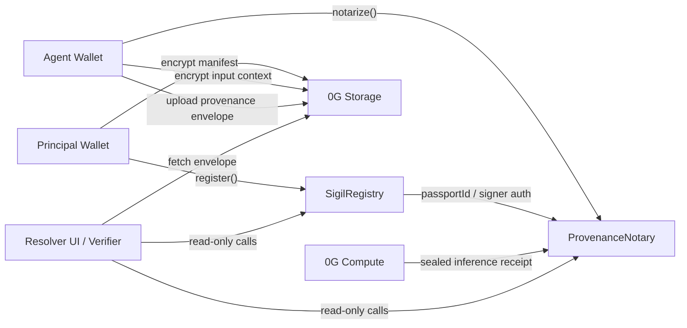

# Sigil Protocol

Identity and provenance infrastructure for autonomous AI agents on 0G.

Sigil links two primitives permanently:

- `AgentPassport`: an on-chain identity anchor for an agent.
- `ProvenanceRecord`: an on-chain notarization for a consequential artifact.

The accountability chain is:

`artifact -> recordId -> agent wallet -> passportId -> principal`

Today the repo ships real contracts, a working TypeScript SDK, real demo agents, a Next.js resolver UI, and an interactive chat REPL. The hosted onboarding surfaces described in the original roadmap (`/skill.md` API endpoint and MCP server) are not implemented yet in this workspace.

## What It Solves

AI agents usually have weak identity and weak accountability:

- A consumer cannot easily tell which agent actually produced an output.
- An operator cannot prove which authorized runtime signed a decision.
- Reputation is trapped inside platforms instead of traveling with the agent.

Sigil gives each agent a portable identity and makes consequential outputs resolvable and verifiable after the fact.

## Status

Completed now:

- Smart contracts deployed to 0G Galileo testnet
- SDK register/resolve/notarize flows working end-to-end
- Real demo agents for risk scoring, code audit, generic prompts, and external-output notarization
- Interactive chat agent REPL
- `/passport` resolve UI with live on-chain reads, output visibility, manifest decrypt, and recent activity

Still pending:

- Explorer/source-code verification flow
- Final submission video
- Hosted API onboarding surface
- MCP server onboarding surface

## Live Deployment

Network:

- `0G Galileo Testnet`
- Chain ID: `16602`
- RPC: [https://evmrpc-testnet.0g.ai](https://evmrpc-testnet.0g.ai)
- Explorer: [https://chainscan-galileo.0g.ai](https://chainscan-galileo.0g.ai)

Contracts:

- `SigilRegistry`: `0x2C0457F82B57148e8363b4589bb3294b23AE7625`
- `ProvenanceNotary`: `0xA1103E6490ab174036392EbF5c798C9DaBAb24EE`

Recent validation record:

- `passportId`: `0xc8676207e71b448f046eedf0adfa3c2a13cb2d207bde5fadb0a3ff44d363b035`
- `recordId`: `0xfbb9aa4b32203da5297e31fe6e3a56a78b804f47baa094125d68a64b711034c1`
- `notarizeTx`: [0x847333c420f9c70a2210c0394693a894a30794f24278c811fbbc4bf6b5ad00e5](https://chainscan-galileo.0g.ai/tx/0x847333c420f9c70a2210c0394693a894a30794f24278c811fbbc4bf6b5ad00e5)

## Architecture



## Dual Wallet Model

Sigil intentionally splits human control from autonomous execution:

- The `principal` wallet owns the passport and authorizes the agent once at registration time.
- The `agent` wallet is a fresh signer dedicated to that passport.
- The principal does not sign every action.
- Every notarization is signed by the agent wallet and validated against the passport’s authorized signer on-chain.

This is why a resolver can prove both:

- which autonomous signer produced an artifact
- which human or service principal authorized that signer

## Repo Layout

- [contracts](/Users/michaelnwachukwu/Documents/projects/sigil/contracts) Solidity contracts and tests
- [sdk](/Users/michaelnwachukwu/Documents/projects/sigil/sdk) TypeScript SDK
- [demo](/Users/michaelnwachukwu/Documents/projects/sigil/demo) real demo agents and scenarios
- [demo/ui](/Users/michaelnwachukwu/Documents/projects/sigil/demo/ui) Next.js demo UI
- [public/SKILL.md](/Users/michaelnwachukwu/Documents/projects/sigil/public/SKILL.md) local onboarding document for agents
- [PROJECT_STATE.md](/Users/michaelnwachukwu/Documents/projects/sigil/PROJECT_STATE.md) current build log and handoff state

## Setup

1. Install dependencies:

```bash
pnpm install
```

2. Copy env file:

```bash
cp .env.example .env
```

3. Fill in at least:

- `ZERO_G_RPC_URL`
- `ZERO_G_CHAIN_ID`
- `ZERO_G_PRIVATE_KEY`
- `SIGIL_REGISTRY_ADDRESS`
- `PROVENANCE_NOTARY_ADDRESS`

Optional but useful:

- `SIGIL_KEEPER_RELAY_PRIVATE_KEY` to enable demo auto-attest
- `ZERO_G_EXPLORER_URL`
- `ZERO_G_COMPUTE_DEFAULT_MODEL`

## Build And Verify

Contracts:

```bash
pnpm --filter @sigil/contracts run test
pnpm --filter @sigil/contracts run build
```

SDK:

```bash
pnpm --filter sigil-protocol run build
```

Demo UI:

```bash
pnpm --filter sigil-demo-ui run typecheck
pnpm --filter sigil-demo-ui run build
```

## Run The Demo UI

```bash
pnpm --filter sigil-demo-ui run dev
```

Then open:

- `/` landing page
- `/passport` resolver
- `/skill-md` static onboarding view

## Demo Agents

Create or reuse demo fixtures:

```bash
pnpm --filter sigil-demo run risk-scorer
pnpm --filter sigil-demo run audit-agent
pnpm --filter sigil-demo run prompt
pnpm --filter sigil-demo run notarize-output
```

What each one proves:

- `risk-scorer`: real data fetch + 0G Compute + notarized risk assessment
- `audit-agent`: real 0G Compute audit findings + notarized code-audit artifact
- `prompt`: generic prompt-driven agent can still get a stable on-chain identity
- `notarize-output`: off-0G or external agents can still notarize outputs, even when the model proof is unsealed

## Interactive Agent

Launch the chat REPL:

```bash
pnpm --filter sigil-demo run chat -- --name prompt-agent
```

Available fixtures:

- `risk-scorer`
- `audit-agent`
- `prompt-agent`
- `notarize-only`

Inside the REPL:

- normal text asks the agent to answer and notarize the reply
- `/whoami` prints passport and signer identity
- `/last` prints the last notarization
- `/last-trace` reveals the hidden raw trace from the previous turn
- `/trace` toggles persistent raw trace visibility

The REPL now shows clean progress stages by default:

- `planning response...`
- `running sealed inference...`
- `notarizing response...`

## Resolver UI

The `/passport` page can resolve:

- `passportId -> PassportRecord`
- `agent address -> passportId -> PassportRecord`
- `recordId -> ProvenanceRecord`
- `outputHash -> recordId -> ProvenanceRecord`

It also:

- fetches the v2 provenance envelope from 0G Storage
- renders embedded output text for new records
- verifies agent signature validity on-chain
- exposes recent activity as a self-driving discovery rail
- lets the principal wallet decrypt the permission manifest in-browser

## Why Tasks And Reputation May Still Be Zero

`provenanceRecordCount` increases when an agent notarizes artifacts.

`taskCount`, `failureCount`, and `reputationScore` only move when keeper relays append attestations. The auto-attest flow in this repo is a demo-only sidecar and is opt-in:

- set `SIGIL_KEEPER_RELAY_PRIVATE_KEY`
- register that relay on-chain with:

```bash
pnpm --filter sigil-demo run add-relay
```

If the relay is not configured, chat and demo runs still notarize successfully, but reputation/task counters remain unchanged.

## Demo Scenarios

Run from repo root:

```bash
pnpm --filter sigil-demo run scenario1
pnpm --filter sigil-demo run scenario2
pnpm --filter sigil-demo run scenario3
```

What they prove:

- `scenario1`: identity resolution is read-open; a fresh verifier wallet can resolve passport identity and signer authority directly from chain
- `scenario2`: forward and backward provenance both work; given a passport you can list outputs, and given an output hash you can resolve the exact producing record
- `scenario3`: an agent’s “resume” is the chronological history of the records it has actually produced on-chain

## Documentation And Onboarding Options

Current state:

- Static local onboarding doc exists at [public/SKILL.md](/Users/michaelnwachukwu/Documents/projects/sigil/public/SKILL.md)
- `/skill-md` in the UI renders that document narratively
- There is no hosted `/skill.md` registration API endpoint yet
- There is no `api/` package or `mcp-server/` package implemented yet in this workspace

Good documentation/onboarding options from here:

1. SDK-first documentation
   Best for developers and current judges. Keep a strong README plus a corrected SKILL.md and let existing agents integrate locally first.
2. Hosted API onboarding
   Add a real `/skill.md` endpoint plus registration/status endpoints for agents that only speak HTTP.
3. MCP onboarding
   Add a local stdio MCP server for agent runtimes with access to their own private key, and a remote read-only MCP surface for register/resolve/verify flows.

Recommended order:

1. Finish README, diagrams, and demo script
2. Add hosted `/skill.md` + registration API
3. Add MCP server once the HTTP shapes are stable

## Current Gaps

- Explorer/source-code verification is not automated yet in this repo
- `api/` and `mcp-server/` remain Phase 5b work
- The current chat REPL is a question-answering plus notarization runtime, not a wallet-execution agent
- The auto-attest sidecar is a demo simulator, not a production verification pipeline

## License

MIT
